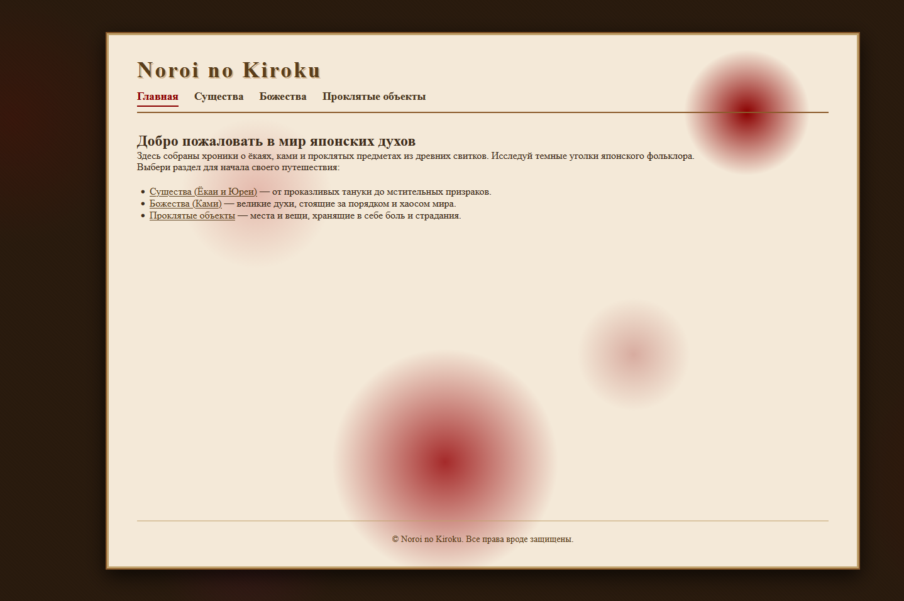
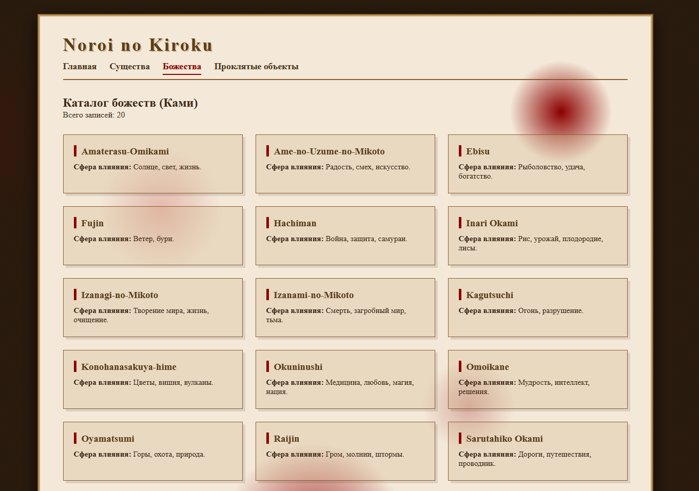
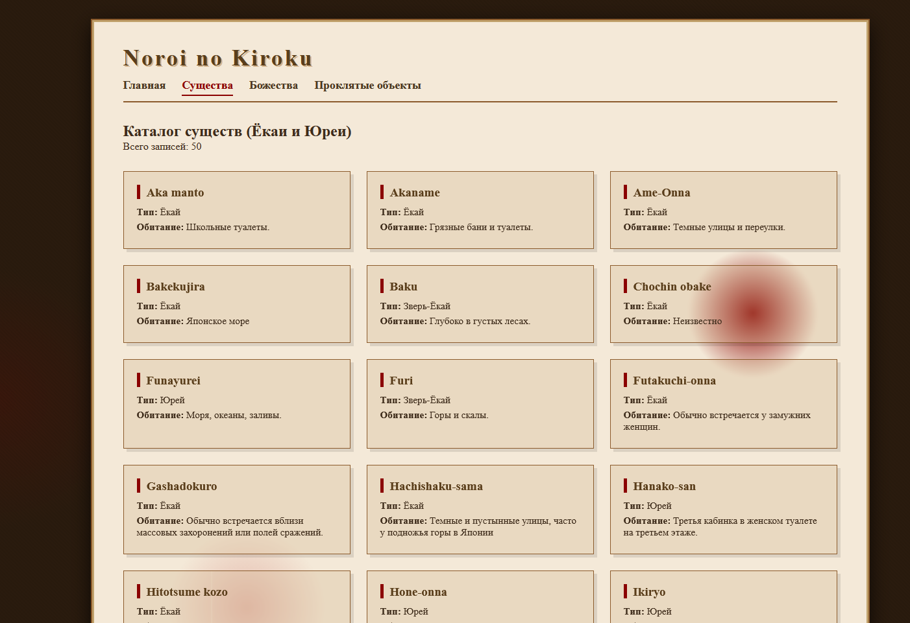
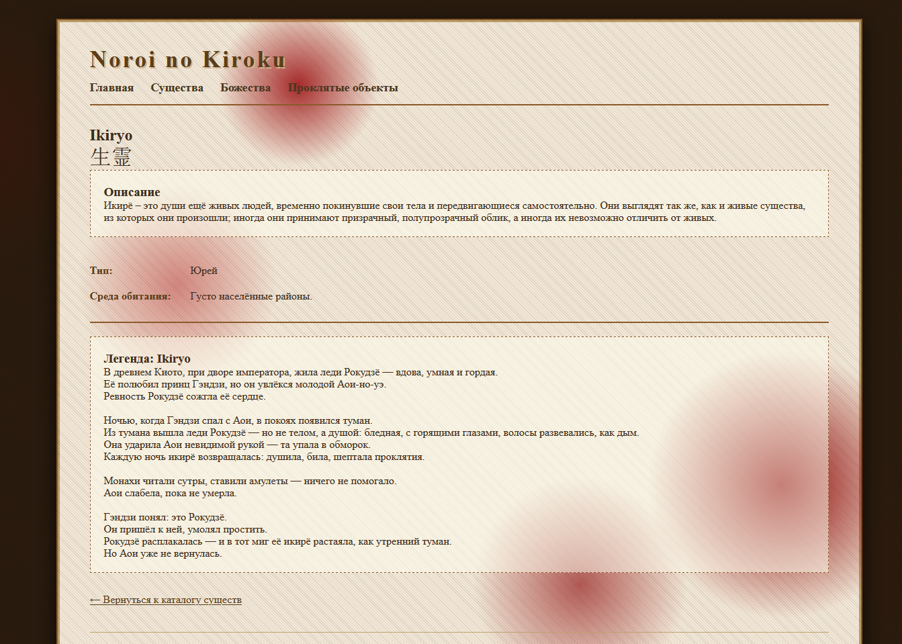

# Noroi no Kiroku


## О проекте

**Noroi no Kiroku** — это архив древних записей,
содержащий хроники ёкаев, ками и проклятых сущностей.

Интерфейс выполнен в виде развернутого свитка или чего-то похожего на письмо.

---

## 

Эта версия является **архивной (Legacy)**.

Она отражает раннюю концепцию проекта — более мрачную и художественную интерпретацию мира.

---

## Превью

<p align="center">
  
  
</p>

<p align="center">
  
  
</p>

---
---

## Запуск через XAMPP

1. Распаковать проект в:

   ```
   xampp/htdocs/noroi-no-kiroku
   ```

2. Запустить Apache и MySQL в xampp

3. Импортировать базу данных (sql/mythology.sql) через phpMyAdmin( http://localhost/phpmyadmin/index.php )

4. Настроить подключение в PHP

5. Открыть:

   ```
   http://localhost/noroi-no-kiroku/index.php
   ```

---

## Этот архив является ранней формой проекта **[Yokai No Jinja](https://github.com/soykoulen/Yokai-no-JinjaRUS)**

---
